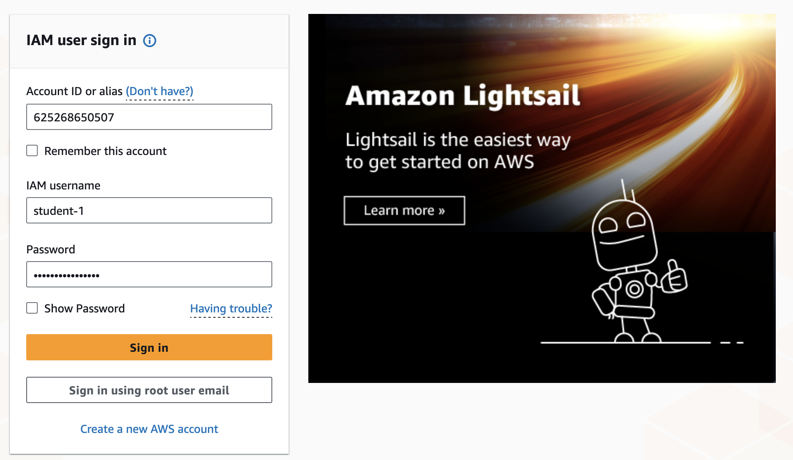
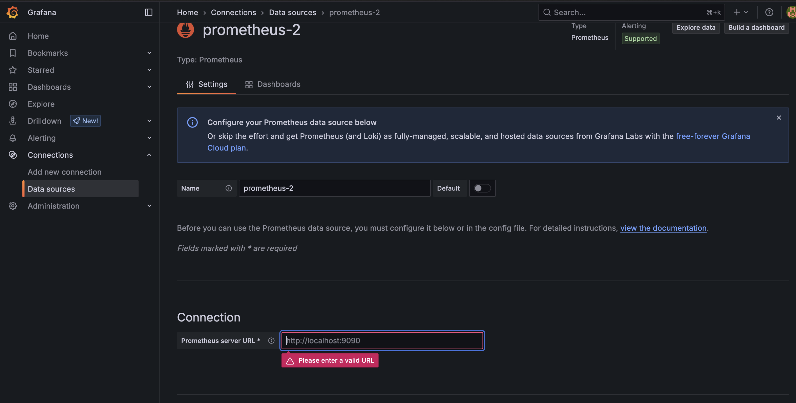

# 💡 Hands-on Day 3 Morning — vLLM in Production

This guide walks you step-by-step through deploying a vLLM server (`Mistral 7B Instruct`) on an AWS GPU instance, with monitoring via Grafana + Prometheus + NVIDIA DCGM.

📄 **Client notebook**: `client_vllm_test_notebook.ipynb`  
📊 **Grafana dashboard**: `vllm_dashboard.json`

---

## 0. Sign-in Amazon

Go to the website: [AWS Sign-in (Europe Stockholm)](https://eu-north-1.signin.aws.amazon.com/console)

Set the Id: 625268650507

Set your username and your password




## 1. Launch an AWS GPU Instance

### 📋 Main steps
1. Go to EC2 > Instances > *Launch an instance*


Set the name: "instance-gpu-student-<YOUR NUMERO>

You can choose the number of instances to launch (leave it at 1).

2. Set the Region at Europe(Stockholm)


3. Choose **UBUNTU**, then the AMI: `Deep Learning OSS NVIDIA Driver AMI GPU PyTorch 2.6`

Next, select your operating system. Choose **Ubuntu** with the AMI:  
**"Deep Learning OSS NVIDIA Driver AMI GPU PyTorch 2.7"**:


Click on **Confirm the changements**

4. Select instance type: `g5.2xlarge`

For the instance type, select **"g5.2xlarge"**.  
You can compare different instance types and their specifications here:  
https://aws.amazon.com/ec2/instance-types/g5/


5. (SSH) Key pair (login): use **quickscale-ai-day3-morning**


6. Adjust *Network Settings*: Select **Launch-wizard-11**
  That will open ports **8000** and **3000** for custom TCP and authorize connections from any IP adress.


7. Configure storage **(100 GB recommended)**


8. For a **Spot Instance**, check `Request Spot Instance` under *Advanced Details*


9.  Create the instance

10. Connect to the instance that you created


---

## 2. Setup vLLM with docker

### 📦 Official Docker Image

👉 Available at: [vllm/vllm-openai on Docker Hub](https://hub.docker.com/r/vllm/vllm-openai/tags)

Docker is already installed on the instance (check it with "docker --version"), so simply pull the image:

```bash
docker pull vllm/vllm-openai
```

---

### 🧠 Model: `Mistral-7B-Instruct-v0.2`

We will use the **Mistral 7B Instruct v0.2** model.  
Before using it, you must:
- Review the model’s license and terms of use
- Generate a **read access token** on Hugging Face

🔗 Model on Hugging Face:  
https://huggingface.co/mistralai/Mistral-7B-Instruct-v0.2

First, install the Hugging Face CLI:

```bash
pip install --upgrade huggingface_hub
huggingface-cli login
```

Set your token. It will not be display.

If issue with the token:
```bash
sudo chown -R ubuntu:ubuntu /home/ubuntu/.cache/huggingface
```

---

### 🚀 Launch the vLLM Server (Docker Run)

Once you have your Hugging Face token, launch the container with:

```bash
docker run -it --gpus all -p 8000:8000 \
  -v $HOME/.cache/huggingface:/root/.cache/huggingface \
  -e HUGGINGFACE_HUB_TOKEN=$HF_TOKEN \
  vllm/vllm-openai \
  --model mistralai/Mistral-7B-Instruct-v0.2 \
  --dtype float16 \
  --gpu-memory-utilization 0.95 \
  --download-dir /root/.cache/huggingface \
  --trust-remote-code \
  --served-model-name mistral-7b \
  --enable-server-load-tracking
```

You have a working vLLM server! You can test it on the Notebook "Client_side.ipynb".


You can explore and interact with the vLLM server's OpenAI-compatible API using the built-in Swagger UI, available at `http://<server-address>:8000/docs`. This web interface allows you to view all available endpoints, read documentation, and make test API calls directly from your browser.

---

## 3. Deploy a Monitored vLLM Server with Docker Compose (vLLM + Prometheus + Grafana + NVIDIA DCGM)

To effectively monitor your vLLM server beyond simple terminal logs, we will use Docker Compose to launch a multi-container setup including:

* `vLLM` inference server
* `Prometheus` to scrape and store metrics
* `Grafana` to visualize metrics
* `NVIDIA DCGM Exporter` to monitor GPU utilization

This configuration allows you to collect metrics from both vLLM and the GPU in a fully containerized setup.

---

### 🛠️ Step 1 — Create `docker-compose.yml`

```bash
nano docker-compose.yml
```

```yaml
version: "3.8"

services:
  vllm:
    image: vllm/vllm-openai
    ports:
      - "8000:8000"
    environment:
      - HUGGINGFACE_HUB_TOKEN=${HF_TOKEN}
    command: >
      --model mistralai/Mistral-7B-Instruct-v0.2
      --dtype float16
      --gpu-memory-utilization 0.95
      --download-dir /root/.cache/huggingface
      --enable-server-load-tracking
      --trust-remote-code
      --served-model-name mistral-7b
    volumes:
      - ~/.cache/huggingface:/root/.cache/huggingface
    deploy:
      resources:
        reservations:
          devices:
            - capabilities: [gpu]

  dcgm-exporter:
    image: nvidia/dcgm-exporter:latest
    runtime: nvidia
    ports:
      - "9400:9400"

  prometheus:
    image: prom/prometheus
    ports:
      - "9090:9090"
    volumes:
      - ./prometheus.yml:/etc/prometheus/prometheus.yml
      - prometheus-storage:/prometheus

  grafana:
    image: grafana/grafana
    ports:
      - "3000:3000"
    environment:
      - GF_SECURITY_ADMIN_PASSWORD=admin
    volumes:
      - grafana-storage:/var/lib/grafana

volumes:
  grafana-storage:
  prometheus-storage:
```

---

### 🛠️ Step 2 — Create `prometheus.yml`

```bash
nano prometheus.yml
```

```yaml
global:
  scrape_interval: 5s

scrape_configs:
  - job_name: 'vllm'
    static_configs:
      - targets: ['vllm:8000']

  - job_name: 'dcgm'
    static_configs:
      - targets: ['dcgm-exporter:9400']
```

---

### 🚀 Step 3 — Launch the Monitoring Stack

Before running the new container, make sure to stop and remove the previous one (if running):

```bash
docker ps
```
Find the container id and execute: 

```bash
docker stop <container_id>
docker rm <container_id>
```


Make sure both files (`docker-compose.yml` and `prometheus.yml`) are in the same directory. Then run:

```bash
docker compose up -d
```

> The `-d` flag runs the containers in detached mode.

To verify everything is running:

```bash
docker compose ps
```

---

### ✅ Results

* The `vLLM` server is now running and serving the OpenAI-compatible API on port **8000**.
* `Prometheus` is scraping metrics from vLLM and the DCGM exporter.
* `Grafana` is available on port **3000**, ready to visualize data.

At this stage, your infrastructure is ready for advanced dashboard creation and GPU monitoring — covered in the next section.


## 4. Set Up Grafana Dashboards for vLLM and GPU Metrics

With your monitoring stack running, you can now use Grafana to build dashboards for real-time insights.

###  Access Grafana

Open your browser and go to:

```
http://<YOUR_PUBLIC_IP>:3000
```

Log in using the default credentials:

* **Username**: `admin`
* **Password**: `admin`

You will be prompted to change the password after the first login.

---

###  Add Prometheus as a Data Source

1. Click **"Add your first data source"** on the home screen.


2. Choose **Prometheus**.

3. Set a name such as "vllm data source"

4. In the "HTTP" section, set:

   * **URL**: `http://prometheus:9090`



   
5. Click **"Save & Test"** to confirm the connection.

---

### Create a Dashboard

1. Go to dashboard in the panel on the left.

2. Click on add vizualisation 

3. Select your data source (the one you created)

4. You can draw and custom panel

Building dashboards from scratch can be time-consuming and tedious. Fortunately, there are ready-made templates available to help you get started quickly!

### 📊 Import a vLLM Dashboard

You can import a prebuilt dashboard instead of building one from scratch:

1. In the sidebar, go to **Dashboards > New > Import**.
2. Upload the provided `vllm_dashboard.json` file or paste its contents.
3. Choose a name like **"vLLM Dashboard"**, select your Prometheus data source, and click **"Import"**.

Update the model name in the dashboard to match the one you are using.

This dashboard includes common vLLM metrics such as:

* Token generation counts
* Request latencies
* Throughput

---

### 🎮 Add GPU Monitoring (DCGM Dashboard)

To monitor GPU metrics:

1. Go to **Dashboards > New > Import**.
2. Use this Grafana dashboard ID:

```
12239
```

3. Name the dashboard (e.g. "NVIDIA GPU Monitoring") and confirm that the Prometheus data source is selected.
4. Click **Import**.

This dashboard shows real-time GPU utilization, memory usage, temperature, power draw, and other key hardware stats from the NVIDIA DCGM exporter.

---

###  Save and Reuse Dashboards

You can customize and save your dashboards as needed. Saved dashboards are accessible under the **Dashboards** tab for future use or sharing with your team.

Your monitoring setup is now complete!

## 6. To go further

If you want to go further, you can:

1. Now it is your turn to lauch your LLM server alone. Lauch a TGI server with the official docker image and draw dashboards with Grafana. Compare the performance with vLLM.

If you do not like TGI, do the same with NVIDIA NIM.

2. Benchmark the maximum requests size X your server can handle in parallel, or benchmark for a fixed number of concurrent requests how long the requests can be.

3. Try and compare quantized models